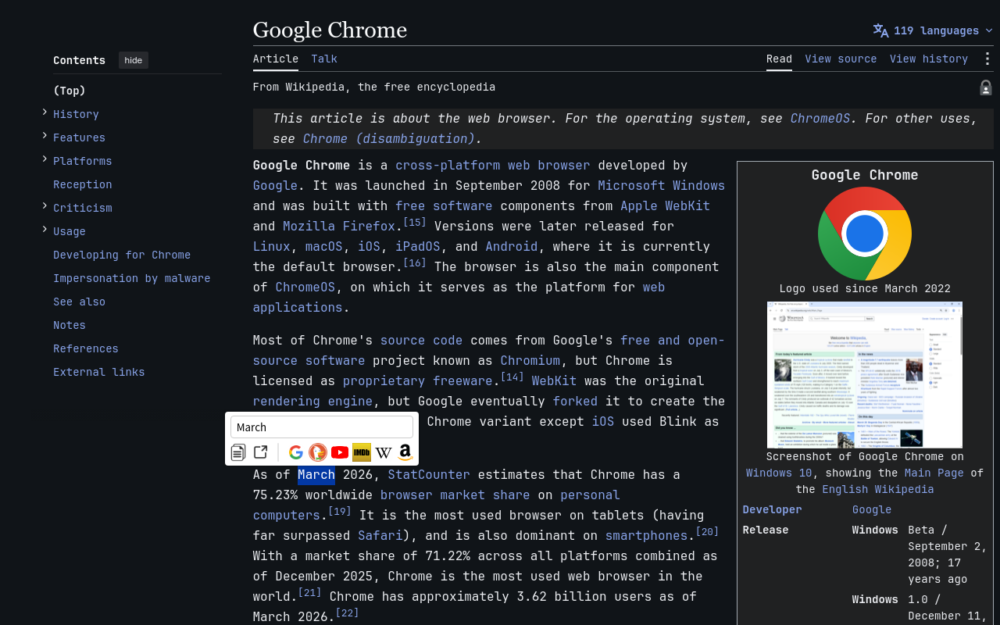
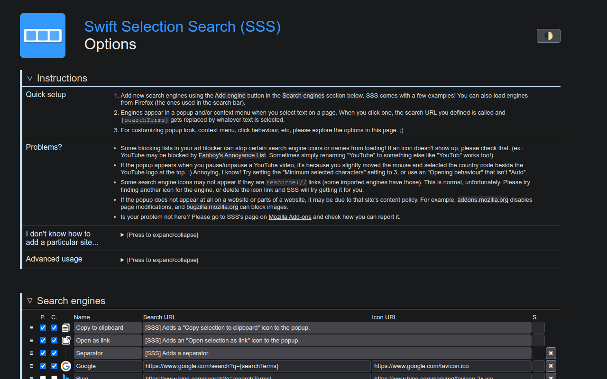

# Swift Selection Search for Chrome

This project is a fork of [CanisLupus/swift-selection-search](https://github.com/CanisLupus/swift-selection-search), adapted for Chrome.

The upstream project is a Firefox extension. This fork updates its background process, permissions, and content scripts for **Chrome Manifest V3**, while preserving the following core features:

- Display a search-engine popup after selecting text
- Search selected text with custom search engines
- Configure the popup appearance and result-opening behavior
- Search from the context menu
- Keyboard shortcuts
- Import and export settings

<a href="https://chromewebstore.google.com/detail/swift-selection-search/imminkkhgldibmkjekahkgbgkkmglhdp">
  
  <strong>Install from Chrome Web Store</strong>
</a>


Chrome does not provide all of the APIs available in Firefox. Consequently, this version cannot read or import the browser's built-in search engines, and Chrome context-menu items cannot distinguish between middle- and right-button clicks. Custom search engines are unaffected.

<p align="center">
  
  
</p>

## Build

Node.js 22 or a compatible version is recommended:

```bash
npm install
npm run typecheck
npm run build
```

The generated JavaScript files are written to the `src` directory.

## Load in Chrome

1. Open `chrome://extensions`.
2. Enable **Developer mode**.
3. Click **Load unpacked**.
4. Select the repository's `src` directory.
5. After changing the code, run `npm run build`, reload the extension, and refresh the pages being tested.

Chrome extensions cannot run on `chrome://` pages or Chrome Web Store pages due to browser security restrictions.

## Releases

See [RELEASING.md](RELEASING.md) for Chrome Web Store and GitHub automated release instructions.

## Upstream project and license

- Upstream: [CanisLupus/swift-selection-search](https://github.com/CanisLupus/swift-selection-search)
- License: [MIT](LICENSE)
