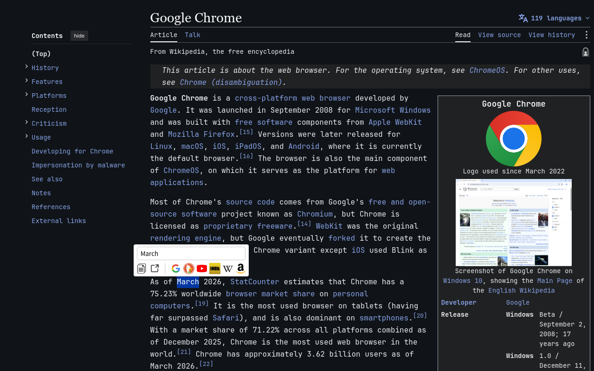
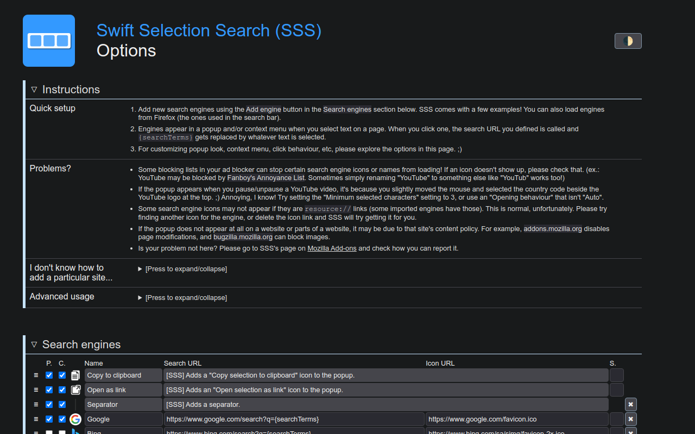
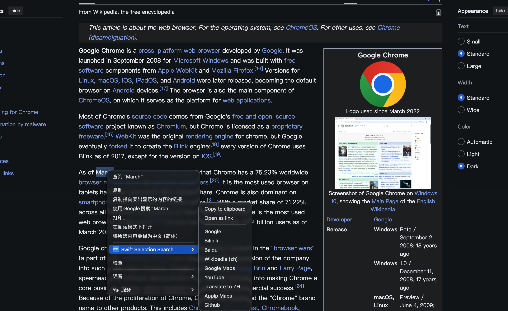

# Swift Selection Search for Chrome

<p align="center">
  
  
  
</p>

This project is a fork of [CanisLupus/swift-selection-search](https://github.com/CanisLupus/swift-selection-search), adapted for Chrome.

The upstream project is a Firefox extension. This fork updates its background process, permissions, and content scripts for **Chrome Manifest V3**, while preserving the following core features:

- Display a search-engine popup after selecting text (this can be turned off in the options)
- Search selected text with custom search engines
- Configure the popup appearance and result-opening behavior
- Search from the context menu: right-clicking a selection shows a submenu named after the extension with the same engines as the popup, for users who prefer not to have the popup appear automatically
- Keyboard shortcuts
- Import and export settings

<a href="https://chromewebstore.google.com/detail/swift-selection-search/imminkkhgldibmkjekahkgbgkkmglhdp">
  
  <strong>Install from Chrome Web Store</strong>
</a>


## Differences from the original extension

Besides porting the project from Firefox to **Chrome Manifest V3**, this fork intentionally differs from [the original](https://github.com/CanisLupus/swift-selection-search) in a few ways:

### Platform and architecture

- Uses a Manifest V3 **service worker** instead of a persistent background page.
- Content scripts are declared in `manifest.json` instead of relying on blocking `webRequest` / CSP workarounds.
- Uses `chrome.storage` and the Chrome `contextMenus` / `commands` APIs.
- **Cannot read or import the browser's built-in search engines**, because Chrome exposes no API for that (Firefox does). Custom search engines are unaffected.

### Behaviour and options

- The right-click submenu is **always enabled** and titled with the extension name (`Swift Selection Search`), instead of the configurable `Search for "%s"` title.
- The submenu lists **exactly the same engines as the selection popup** (the `P.` enabled state). The separate per-engine `C. Show in context menu` checkbox, the `Is the context menu enabled?` option and the `Context menu title` option were removed to keep a single source of truth.
- Added an **Auto-open on text selection** toggle, so users who do not like the popup can disable it and search only from the right-click menu or the keyboard shortcut.
- Chrome context-menu items only report left clicks, so the separate right-click and middle-click context-menu behaviours were removed; there is a single context-menu click behaviour.
- No icons are shown in the native context menu, because Chrome's `contextMenus` API does not support per-item icons (the menu is text-only).

A few upstream behaviours are preserved as-is: the selection popup, custom engines and groups, shortcuts, popup appearance options, and import/export of settings.

## Build

Node.js 22 or a compatible version is recommended:

```bash
npm install
npm run typecheck
npm run build
```

The generated JavaScript files are written to the `src` directory.

## Load in Chrome

1. Open `chrome://extensions`.
2. Enable **Developer mode**.
3. Click **Load unpacked**.
4. Select the repository's `src` directory.
5. After changing the code, run `npm run build`, reload the extension, and refresh the pages being tested.

Chrome extensions cannot run on `chrome://` pages or Chrome Web Store pages due to browser security restrictions.

## Releases

See [RELEASING.md](RELEASING.md) for Chrome Web Store and GitHub automated release instructions.

## License

[MIT](LICENSE)
